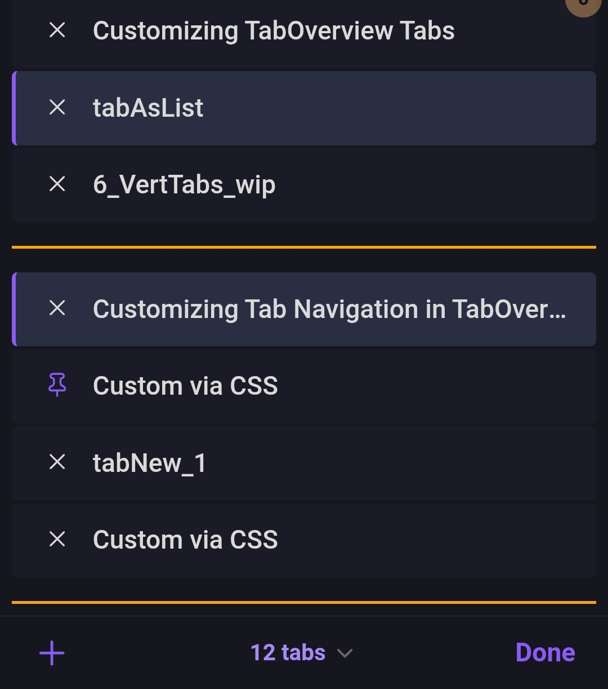
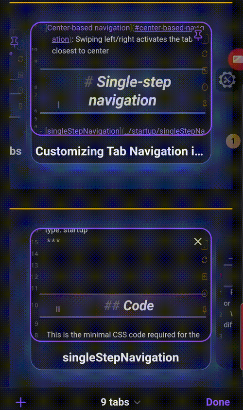
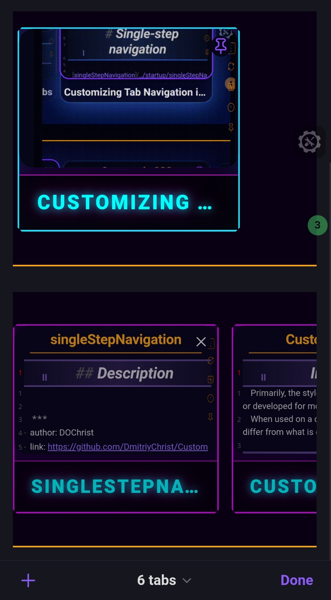

There are main approaches:  
- [Modified default view](#modified-default-view)
-  [Vertical tab layout](#vertical-tab-layout)
- [Horizontal tab layout](#horizontal-tab-layout)

All the options with vertical layout work fine, and overall the behavior does not differ from the default behavior.

However, when switching to horizontal tab layout, several issues arise:
- When switching between groups, there is an automatic scroll to the first tab in the group.
- When closing a tab, the scroll also moves to the first tab of the group.

# Modified default view

- [tabOverview_purple](tabOverview_purple.md)

***
- [tabOverview_green](tabOverview_green.md)

***

# Vertical tab layout 

- [tabAsList](tabAsList.md)

***
- [tabOverview_V3](tabOverview_V3.md)

***

# Horizontal tab layout

- [tabOverview_H01](tabOverview_H01.md)
- By default, the highlight will be static only on the last opened tab. Dynamic tab highlight behavior is implemented using [Customizing Tab Navigation in TabOverview](../../../custom%20JS/articles/Customizing%20Tab%20Navigation%20in%20TabOverview.md) 

***
- [tabOverview_H02_neo](tabOverview_H02_neo.md)

***
- [tabOverview_H03_brutal](tabOverview_H03_brutal.md)

