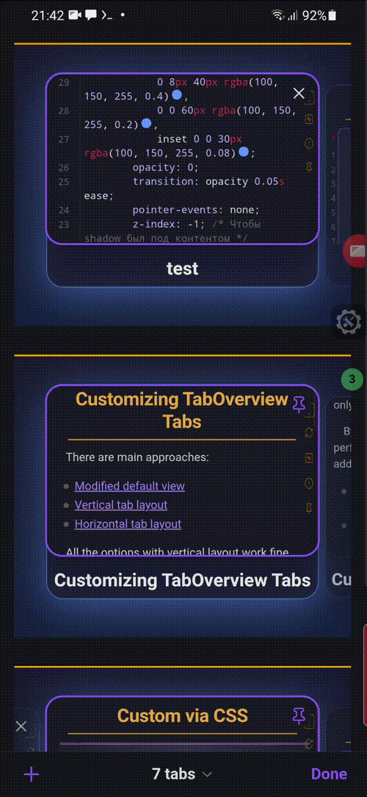

## Description

This CSS snippet defines a modern, dark-themed mobile tab interface with smooth animations and clear selective state indication.

***
- author: DOChrist
- link: https://github.com/DmitriyChrist/Custom_Obs_journal_DOC
***




## Code

```css
body.is-mobile {
    .mobile-tab-group-container {
        display: flex;
        flex-direction: row;
        flex-wrap: nowrap;
        padding: 5vh;
        border-top: 2px solid orange;
        background: linear-gradient(#1a1a2e, #16213e);
        overflow-x: auto;
        scroll-snap-type: x mandatory;
        -webkit-overflow-scrolling: touch;
        
        /* Hide scrollbar */
        scrollbar-width: none;
        -ms-overflow-style: none;
    }
    
    .mobile-tab-group-container::-webkit-scrollbar {
        display: none;
    }

    .mobile-tab-wrapper {
        flex: 0 0 auto;
        width: 70vw;
        scroll-snap-align: center;
    }

    .mobile-tab {
        position: relative;
        opacity: 0.7;
        background: rgba(30, 30, 50, 0.8);
        border: 1px solid rgba(100, 150, 255, 0.2);
        border-radius: 18px;
        transition-property: opacity, border-color, transform;
        transition-duration: 0.05s;
        transition-timing-function: ease;
    }
  
    .mobile-tab::after {
        content: '';
        position: absolute;
        inset: 0;
        border-radius: 18px;
        box-shadow: 
            0 8px 40px rgba(100, 150, 255, 0.4),
            0 0 60px rgba(100, 150, 255, 0.2),
            inset 0 0 30px rgba(100, 150, 255, 0.08);
        opacity: 0;
        transition: opacity 0.05s ease;
        pointer-events: none;
        z-index: -1; /* Чтобы shadow был под контентом */
    }
  
    .mobile-tab.is-active {
        opacity: 1;
        border-color: rgba(100, 150, 255, 0.6);
        transform: scale(1.06) translateY(-5px);
    }
    
    .mobile-tab.is-active::after {
        opacity: 1;
    }
    
    .mobile-tab-preview {
        height: 20vh;
    }
    
    .mobile-tab-title {
        padding: 0.4rem 0.4rem;
        font-size: 1.1rem;
        font-weight: 600;
        color: rgba(255, 255, 255, 0.9);
    }
}
```

