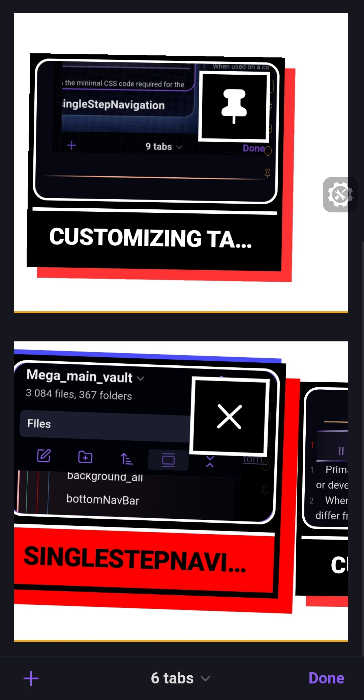

## Description

Brutalist mobile tab layout with aggressive black-and-red visuals inspired by print poster design.

***
- author: DOChrist
- link: https://github.com/DmitriyChrist/Custom_Obs_journal_DOC
***



## Code

```css
body.is-mobile {
    /* === Tab container === */
    .mobile-tab-group-container {
        display: flex;
        flex-direction: row;
        flex-wrap: nowrap;
        padding: 3em 1em;
        gap: 1em;
        
        overflow-x: auto;
        overflow-y: hidden;
        scroll-snap-type: x mandatory;
        -webkit-overflow-scrolling: touch;
        
        background: #fff;
        
        /* Hide scrollbar */
        scrollbar-width: none;
        -ms-overflow-style: none;
    }
    
    .mobile-tab-group-container::-webkit-scrollbar {
        display: none;
    }

    /* === Tab wrapper === */
    .mobile-tab-wrapper {
        flex: 0 0 auto;
        width: 18em;
        scroll-snap-align: start;
    }
    
    /* Peek effect: show part of next card */
    .mobile-tab-wrapper:not(:last-child) {
        margin-inline-end: 1em;
    }
    
    /*Active card gets normal spacing */
    .mobile-tab-wrapper:has(.mobile-tab.is-active) {
        margin-inline-end: 1em;
    }

    /* === Tab card === */
    .mobile-tab {
        position: relative;
        width: 100%;
        background: #000;
        border: 6px solid #000;
        border-radius: 0;
        transform: rotate(-1deg);
        z-index: 1;
        
        /* Brutalist offset shadow */
        box-shadow: 12px 12px 0 rgba(255, 0, 0, 0.8);
        
        /* Animate specific properties */
        transition-property: transform, box-shadow;
        transition-duration: 0.3s;
        transition-timing-function: cubic-bezier(0.68, -0.55, 0.265, 1.55);
    }
    
    /* Random rotations for variety */
    .mobile-tab:nth-child(odd) {
        transform: rotate(1deg);
    }
    
    /* Alternate shadow colors */
    .mobile-tab:nth-child(3n) {
        box-shadow: 12px 12px 0 rgba(0, 255, 0, 0.8);
    }

    /* === Active state === */
    .mobile-tab.is-active {
        z-index: 10;
        transform: rotate(2deg) scale(1.1) translateY(-15px);
        box-shadow: 
            15px 15px 0 rgba(255, 0, 0, 1),
            -5px -5px 0 rgba(0, 0, 255, 0.7);
    }

    /* === Tab preview === */
    .mobile-tab-preview {
        height: 10em;
        border: 3px solid #fff;
        filter: grayscale(0.3) contrast(1.2);
        overflow: hidden;
    }

    /* === Tab title === */
    .mobile-tab-title {
        padding: 0.6em 0.8em;
        font-size: 1.5rem;
        font-weight: 900;
        text-transform: uppercase;
        letter-spacing: -0.02em;
        line-height: 1.1;
        color: #fff;
        background: #000;
        border-top: 4px solid #fff;
        
        /* Prepare for animation */
        transition: background 0.3s ease, color 0.3s ease;
    }
    
    .mobile-tab.is-active .mobile-tab-title {
        background: #ff0000;
        color: #000;
        animation: brutal-shake 0.5s ease;
    }
    
    /* Brutal shake animation */
    @keyframes brutal-shake {
        0%, 100% { transform: translateX(0); }
        10% { transform: translateX(-5px); }
        30% { transform: translateX(5px); }
        50% { transform: translateX(-3px); }
        70% { transform: translateX(3px); }
        90% { transform: translateX(-1px); }
    }

    /* === Pin and close button === */
    .mobile-tab-pin,
    .mobile-tab .close-button {
        position: absolute;
        width: 3.5rem;
        height: 3.5rem;
        background: #ff0000;
        border: 3px solid #000;
        border-radius: 0;
        cursor: pointer;
        transition: transform 0.2s ease;
    }
    
    .mobile-tab-pin:hover,
    .mobile-tab .close-button:hover {
        transform: scale(1.1);
    }
    
    /* === Accessibility: Reduced motion === */
    @media (prefers-reduced-motion: reduce) {
        .mobile-tab {
            transition-duration: 0.01ms;
            transform: rotate(-1deg);
        }
        
        .mobile-tab:nth-child(odd) {
            transform: rotate(1deg);
        }
        
        .mobile-tab.is-active {
            transform: rotate(2deg) scale(1.1) translateY(-15px);
            animation: none;
        }
        
        .mobile-tab.is-active .mobile-tab-title {
            animation: none;
        }
        
        .mobile-tab-pin,
        .mobile-tab .close-button {
            transition-duration: 0.01ms;
        }
    }
  /* === Pin and close button === */
.mobile-tab-pin,
.mobile-tab .close-button {
    position: absolute;
    width: 5rem;   /* Even larger */
    height: 5rem;  /* Even larger */
    background: #000;
    border: 4px solid #fff; /* Thicker border */
    border-radius: 0;
    cursor: pointer;
    transition: transform 0.2s ease, box-shadow 0.2s ease;
}

.mobile-tab-pin:hover,
.mobile-tab .close-button:hover {
    transform: scale(1.15);
    box-shadow: 4px 4px 0 #ff0000; /* Brutalist hover effect */
}

.mobile-tab-pin svg,
.mobile-tab .close-button svg {
    color: #fff;
    fill: #fff;
    width: 60%;
    height: 60%;
}
}
```