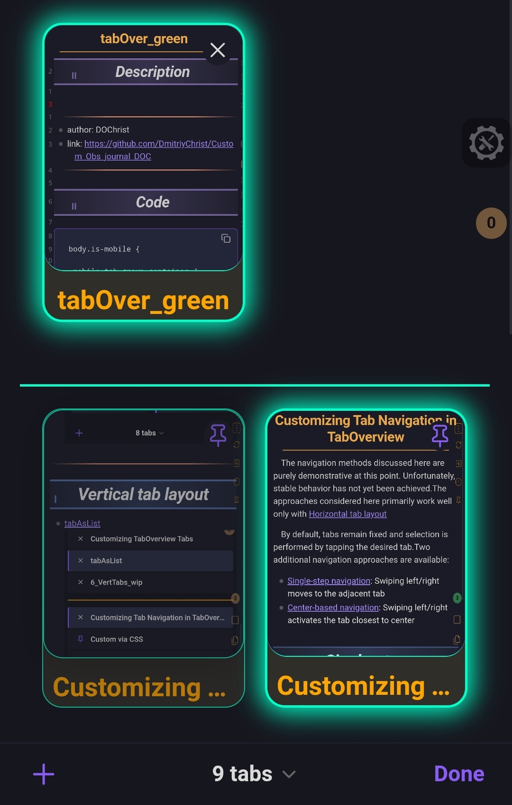

## Description

Mobile tab interface with dark backgrounds, teal borders, and glowing shadows on active state. 
***
- author: DOChrist
- link: https://github.com/DmitriyChrist/Custom_Obs_journal_DOC
***



## Code

```
body.is-mobile {
  
.mobile-tab-group-container {
    padding: 2vh;
    border-top: 2px solid #00ffc8;
}
    .mobile-tab {
        height: 15rem;
        background: #302e29;
        border-radius: 16px;
        scroll-snap-align: start;
        opacity: 0.7;
        border: 1px solid #00ffc8;
    }
  
    .mobile-tab-preview {
      border: 1px solid #00ffc8;
    }
  
    .mobile-tab.is-active {
        box-shadow: 0 0 20px 4px #00FFC8;
        border: 2px solid #00ffc8;
        opacity: 1;
    }
  
    .mobile-tab.is-active .mobile-tab-preview {
      overflow: hidden;
      border: none;
      border-bottom: 1px solid #00ffc8;
    }
  
    .mobile-tab-title {
        font-size: 1.2rem;
        font-weight: 600;
        padding: 0.1em 0.4em;
        color: orange;
    }
}
```
