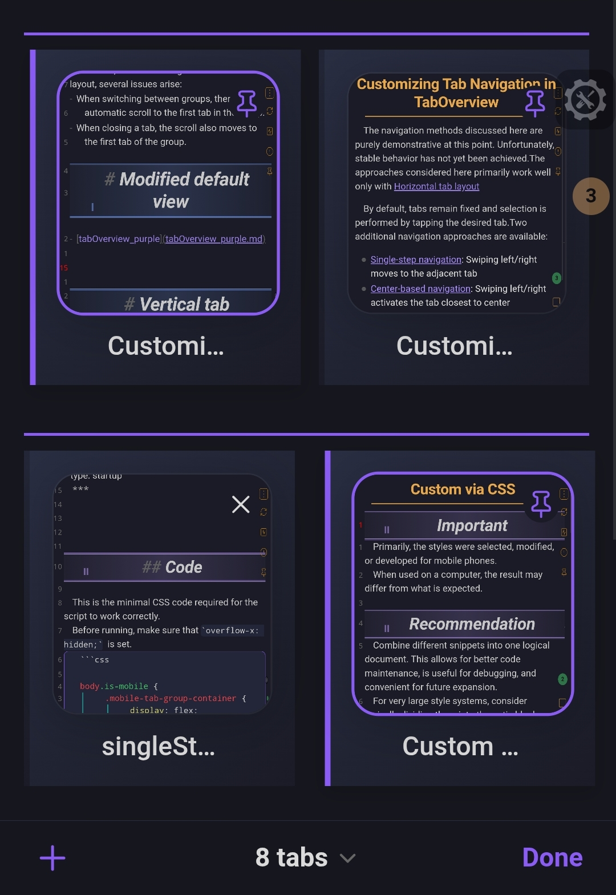

## Description
Clean mobile tab navigation with gradient backgrounds and left border accent.
***
- author: DOChrist
- link: https://github.com/DmitriyChrist/Custom_Obs_journal_DOC
***



## Code


```css
body.is-mobile {
  .mobile-tab-group-container {
    padding-top: 0.6em;
    border-top: 2px solid var(--interactive-accent);
}
    .mobile-tab {
        height: 14em;
        padding: 1em;
        background: linear-gradient(135deg, 
            var(--background-modifier-active-hover) 0%, 
            var(--background-primary-alt) 100%);
        border-left: 4px solid transparent;
    }
    
    .mobile-tab.is-active {
        border-left: 4px solid var(--interactive-accent);
    }
    
    .mobile-tab-title {
        font-size: 1rem;
      padding: 0.2em 02em;
        font-weight: 500;
    }
}
```